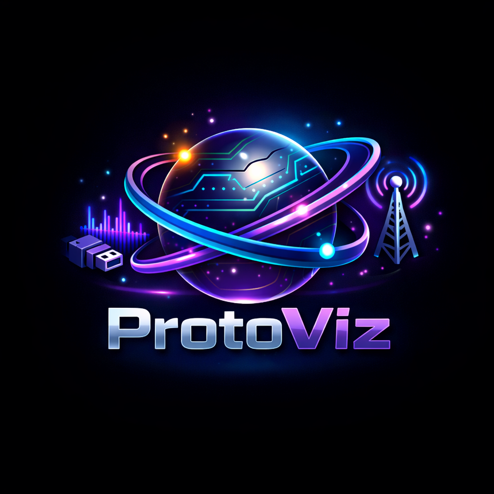

<p align="center">
    
</p>

<h1 align="center">Protoviz 3D</h1>
<p align="center">
  An interactive 3D communication protocol visualizer
</p>


Protoviz 3D is an interactive, web-based 3D communication protocol visualizer designed to help students, embedded engineers, and electronics enthusiasts understand what actually happens on the wire.
The project currently focuses on UART (Universal Asynchronous Receiver Transmitter) and aims to make serial communication visual, intuitive, and observable, rather than abstract.

## 💡 Why Protoviz 3D?

UART is often taught using diagrams and timing charts, but real understanding comes from seeing signals evolve over time.

Protoviz 3D bridges that gap by visualizing:

- Bit-level transmission
- Timing behavior
- Error conditions
- Real-world limitations of asynchronous communication

## ✨ Features (UART)

- Bit-level UART visualization with clear start, data, and stop bits
- Configurable TX/RX baud rates, including mismatch-induced data corruption
- Interactive 3D wiring model (TX, RX, GND) with failure scenarios (shorts)
- Guided tutorial mode with pauseable tutorials and UART deep-dive Q&A
- Fully interactive 3D scene and responsive across devices

> **Note**
>
> To keep the visualization clear and beginner-friendly, input is limited to **50 characters**.  
> Protoviz 3D focuses on learning how protocols work rather than handling large data streams.

## 🛠 Tech Stack

- **Next.js**
- **React**
- **Tailwind CSS**
- **Three.js / React Three Fiber**
- **Zustand**
- **Tailwind CSS**
- **Vercel**

## 📁 Project Structure

```

├── app
│   ├── favicon.ico
│   ├── globals.css
│   ├── layout.tsx
│   └── page.tsx
├── components
│   ├── FloatingNavBar.tsx
│   └── protocol-visualizer
│       ├── ControlPanel.tsx
│       ├── protocols
│       │   └── uart
│       │       ├── InfoPoints.tsx
│       │       ├── UARTBoard.tsx
│       │       ├── UARTParticles.tsx
│       │       ├── UARTScene.tsx
│       │       ├── UARTTutorial.tsx
│       │       ├── UARTWaveform.tsx
│       │       ├── UARTWire.tsx
│       │       └── useUARTLogic.tsx
│       └── ProtocolScene.tsx
├── eslint.config.mjs
├── LICENSE
├── next.config.ts
├── next-env.d.ts
├── package.json
├── package-lock.json
├── postcss.config.mjs
├── public
│   ├── file.svg
│   ├── globe.svg
│   ├── next.svg
│   ├── qna
│   │   └── uart.json
│   ├── vercel.svg
│   └── window.svg
├── README.md
├── tailwind.config.js
├── tsconfig.json
└── types
    └── protocols.ts
```

## 🚀 Getting Started

### Prerequisites

- **Node.js 18+** (recommended)
- **npm** or **pnpm**

## 🛠 Install & Run

| Command         | Description                                                    |
| --------------- | -------------------------------------------------------------- |
| `npm install`   | Installs all required project dependencies                     |
| `npm run dev`   | Starts the local development server at `http://localhost:3000` |
| `npm run build` | Builds an optimized production version of the application      |
| `npm run start` | Runs the production build locally (after `npm run build`)      |

## 🎯 Accuracy & Simulation Notes

This project focuses on conceptual and educational accuracy, not electrical-level precision.

- UART timing, framing, and baud-rate behavior are modeled realistically
- Baud rate mismatch demonstrates sampling drift and data corruption
- Bit-level visuals reflect actual UART framing rules
- Electrical characteristics (voltage levels, noise, slew rates) are intentionally abstracted
  The goal is to help users understand what happens on the wire, not to replace hardware-level analyzers.

## 🗺 Roadmap

Planned and possible future additions:

- I²C protocol visualization (start/stop, ACK/NACK)

## 🤝 Contributing

See [CONTRIBUTING.md](CONTRIBUTING.md) for guidelines.

## 📜 License

This project is licensed under the Personal Use License.
See the [LICENSE](LICENSE) file for full details.

Commercial use, redistribution, or integration into paid products is not permitted without explicit permission.

## ☕ Support the Project

Your feedback is incredibly valuable for improving Protoviz 3D.

- 💬 Share ideas, suggestions, or bug reports via the Discussions page
- ⭐ Star the repository if you find it useful
- 💖 Support ongoing development via:

<p align="left">
  <a href="https://buymeacoffee.com/dhanushmanz">
    
  </a>
  <a href="https://github.com/sponsors/Dhanush-777x">
    
  </a>
</p>

Every contribution, feedback or support helps push this project forward 🚀
