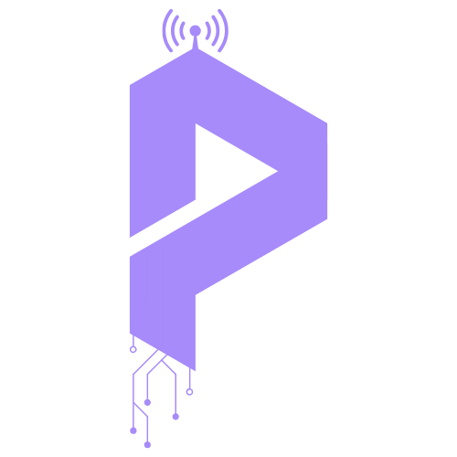

<p align="center">
    
</p>

<h1 align="center">Protoviz 3D</h1>
<p align="center">
  An interactive 3D communication protocol visualizer
</p>


Protoviz 3D is an interactive, web-based 3D communication protocol visualizer designed to help students, embedded engineers, and electronics enthusiasts understand what actually happens on the wire.
The project currently supports **UART (Universal Asynchronous Receiver Transmitter)** and **I²C (Inter-Integrated Circuit)**, aiming to make serial communication visual, intuitive, and observable rather than abstract.

## 🎯 Motivation

Learning communication protocols like UART and I²C is often harder than it needs to be.
For many students and early-career embedded engineers, these protocols are introduced through static timing diagrams, tables, and register descriptions. While technically correct, they often leave one key question unanswered:

**“What is actually happening on the wire?”**
While learning and experimenting with UART and I²C, and using tools like logic analyzers to observe real signals, it became clear that understanding improves dramatically when you can see signals evolve over time. How bits shift, how clocks align devices, and how small mismatches lead to communication issues.

**Protoviz 3D was created to bridge this gap.**
The goal is not to replace datasheets or hardware tools, but to provide an intuitive tool that makes serial communication easier to understand.

## 💡 Why Protoviz 3D?

Communication protocols like UART and I²C are often taught using static diagrams and timing charts, but real understanding comes from seeing signals evolve over time.

Protoviz 3D bridges that gap by visualizing:

- Bit-level transmission
- Timing behavior
- Error conditions
- Real-world limitations of asynchronous communication

## ✨ Features

### UART

- Bit-level UART visualization with clear start, data, and stop bits
- Configurable TX/RX baud rates, including mismatch-induced data corruption
- Interactive 3D wiring model (TX, RX, GND) with failure scenarios (shorts)
- Guided tutorial mode with pauseable tutorials and UART deep-dive Q&A

### I²C

- Bit-level I²C visualization including START, address, R/W bit, ACK/NACK, data, and STOP
- Realistic SDA/SCL bus behavior with shared clock
- Open-drain bus modeling with required pull-up resistors
- Multiple slave devices with address-based communication
- Pause, step, and inspect individual bits on the bus
- Searchable I²C deep-dive documentation integrated into the UI

> [!Tip]
>
> - Press **Space** to pause or resume an active transmission.

> [!Note]
>
> - To keep the visualization clear and beginner-friendly, input is limited to **50 characters**.
> - I²C focuses on byte-level transactions rather than large data streams
> - Protoviz 3D focuses on learning how protocols work rather than handling large data streams.

## 🛠 Tech Stack

- **Next.js**
- **React**
- **Three.js / React Three Fiber**
- **Zustand**
- **Tailwind CSS**
- **Vercel**

## 📁 Project Structure

```
├── app
├── components
│   ├── FloatingNavBar.tsx
│   ├── protocol-visualizer
│   │   ├── CommonStore.tsx
│   │   ├── ControlPanel.tsx
│   │   ├── DeepDive.tsx
│   │   ├── protocols
│   │   │   ├── i2c
│   │   │   │   ├── I2CBasics.tsx
│   │   │   │   ├── I2CBoard.tsx
│   │   │   │   ├── I2CControlPanel.tsx
│   │   │   │   ├── I2CParticles.tsx
│   │   │   │   ├── I2CScene.tsx
│   │   │   │   ├── I2CWaveform.tsx
│   │   │   │   ├── I2CWire.tsx
│   │   │   │   ├── InfoPoints.tsx
│   │   │   │   └── useI2CLogic.tsx
│   │   │   └── uart
│   │   │       ├── InfoPoints.tsx
│   │   │       ├── UARTBasics.tsx
│   │   │       ├── UARTBoard.tsx
│   │   │       ├── UARTControlPanel.tsx
│   │   │       ├── UARTParticles.tsx
│   │   │       ├── UARTScene.tsx
│   │   │       ├── UARTWaveform.tsx
│   │   │       ├── UARTWire.tsx
│   │   │       └── useUARTLogic.tsx
│   │   └── ProtocolScene.tsx
│   └── ProtovizIntro.tsx
├── public
│   ├── deep-dive
│   │   ├── i2c.json
│   │   └── uart.json
└── types
    └── protocols.ts
```

## 🚀 Getting Started

### Prerequisites

- **Node.js 18+** (recommended)
- **npm** or **pnpm**

## 🛠 Install & Run

| Command         | Description                                                    |
| --------------- | -------------------------------------------------------------- |
| `npm install`   | Installs all required project dependencies                     |
| `npm run dev`   | Starts the local development server at `http://localhost:3000` |
| `npm run build` | Builds an optimized production version of the application      |
| `npm run start` | Runs the production build locally (after `npm run build`)      |

## 🎯 Accuracy & Simulation Notes

This project focuses on conceptual and educational accuracy, not electrical-level precision.

- UART timing, framing, and baud-rate behavior are modeled realistically.
- I²C START/STOP conditions, addressing, ACK/NACK, and clocked data transfer are modeled accurately.
- Pull-up resistor behavior is visualized conceptually for I²C.
- Electrical characteristics (voltage levels, noise, slew rates) are intentionally abstracted

The goal is to help users understand what happens on the wire, not to replace hardware-level analyzers.

## 🗺 Roadmap

**Planned and possible future additions:**

- [ ] SPI protocol visualization

**Completed:**

- [x] I²C protocol visualization (start/stop, ACK/NACK)

## 🤝 Contributing

See [CONTRIBUTING.md](CONTRIBUTING.md) for guidelines.

## 📜 License

This project is licensed under the Personal Use License.
See the [LICENSE](LICENSE) file for full details.

Commercial use, redistribution, or integration into paid products is not permitted without explicit permission.

## ☕ Support the Project

Your feedback is incredibly valuable for improving Protoviz 3D.

- 💬 Share ideas, suggestions, or bug reports via the Discussions page
- ⭐ Star the repository if you find it useful
- 💖 Support ongoing development via:

<p align="left">
  <a href="https://buymeacoffee.com/dhanushmanz">
    
  </a>
  <a href="https://github.com/sponsors/Dhanush-777x">
    
  </a>
</p>

Every contribution, feedback or support helps push this project forward 🚀
